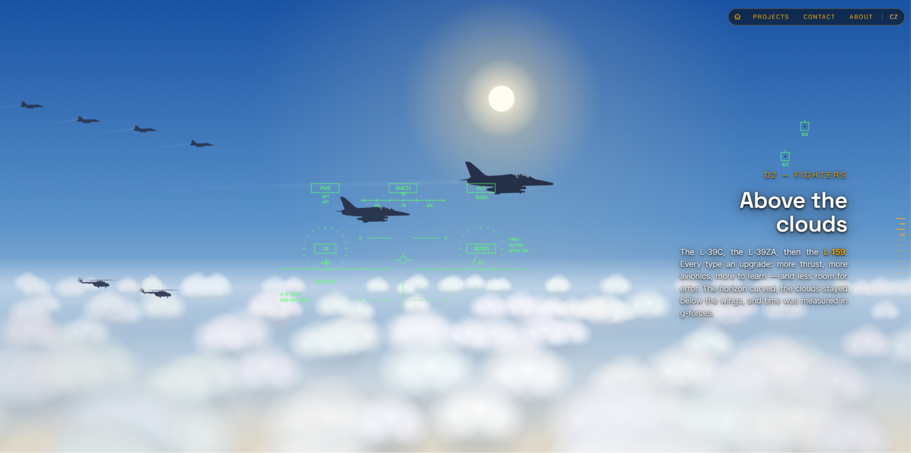
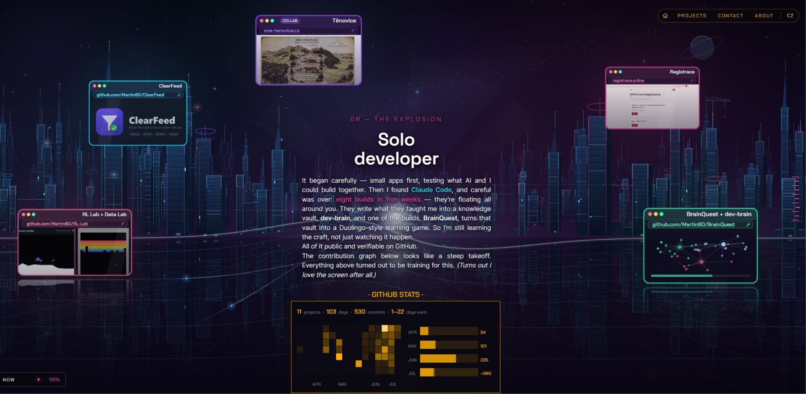

<h1 align="center">Martin — Scroll Through a Life</h1>

<p align="center"><em>Built in 3.5 intense days with Claude Code.</em></p>

A personal **scrollytelling website**: you scroll, and a life flies past — school &
Pascal chess → military fighter pilot (Z‑142, L‑39, L‑159) → Afghanistan → airshow
display flying → self‑healing → Bitcoin → building with Claude Code. **Scroll = time.**
The story is the hook, the projects are the proof, a single email is the goal.

Live: **https://svobodamartin.dev**



## Stack

- **Vite + React + TypeScript** (strict) — no framework beyond React.
- **CSS + custom properties / CSS Modules** for styling (no Tailwind).
- **Lenis** for the one smooth‑scroll rhythm.
- **Vitest** for the pure‑logic unit tests.
- Deployed as a static SPA on **Vercel** (GitHub → Vercel auto‑deploy).

No backend, no cookies, no personal data — just privacy-friendly anonymous page counts (Vercel Web Analytics). Contact is a `mailto:` only.

## Architecture (the mental model)

Everything visible is *derived* from one global value, `scrollProgress` (0..1),
smoothed on the Lenis ticker.

- **`src/data/chapters.ts`** — the single source of truth: a typed `Chapter[]`
  (order + copy + theme + choreography). Adding a chapter is one object. Czech copy
  is an overlay by id (`chapters.cs.ts`); timing lives once, in the EN array.
- **`src/data/projects.ts`** — the Work items (real link · screenshot · one‑liner · stack).
- **`<CanvasStage>`** — one fixed 2D canvas, one rAF loop. A **theme registry**
  (`src/canvas/registry.ts`, `Record<Theme, Renderer>`) picks a pure
  `render(ctx, alpha, localT, time, cfg)` per chapter. A new visual *kind* = one
  registry entry. Renderers are pure and framework‑free (so an L2 3D layer could
  reuse them as the fallback). The whole canvas world is **code‑split** (`React.lazy`)
  — it is decorative (`aria-hidden`) and loads during the preloader hold.
- **Text / HUD / scale / vignette / cards** are DOM components — the story text stays
  real HTML for SEO and screen readers.



## Accessibility & performance (Done‑criteria, not extras)

- `prefers-reduced-motion` → a calm, static per‑scroll frame + native scroll; all
  micro‑motion off.
- Skip‑link is the first tab stop; single `<main>` + real `<h1>`; labelled `<nav>`;
  visible focus rings.
- DPR‑capped canvas (≤2), rAF paused when the tab is hidden, no layout shift.
- Bundle is code‑split: a small app shell + a cacheable React vendor chunk load first;
  the ~500 kB canvas world and the Work panel are lazy.

## Run

```bash
npm install
npm run dev      # local dev server (Vite)
npm run check    # quality gate: tsc --noEmit + eslint + vite build + vitest run
npm run build    # production build → dist/
npm run preview  # serve the production build locally
```

`npm run check` must be green before every commit.

## Project brain

Working notes, the prompt backlog, ADRs and dev history live outside this README:
`docs/adr.md`, `dev_history.md`, and the gitignored `local/` (private).

## License

[MIT](LICENSE) © Martin Svoboda
